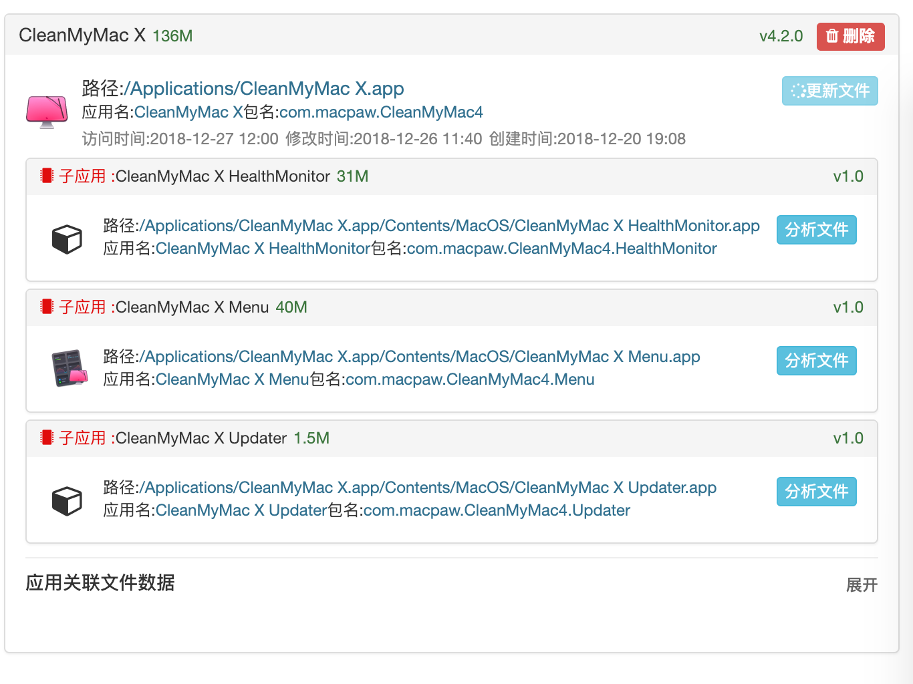
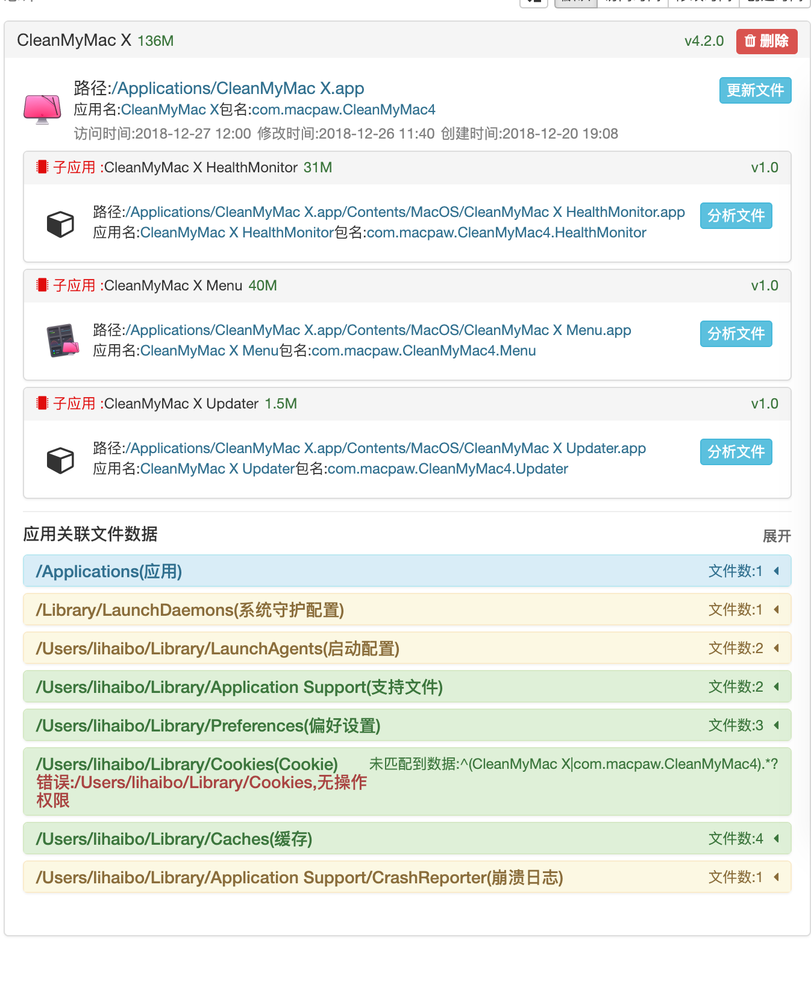
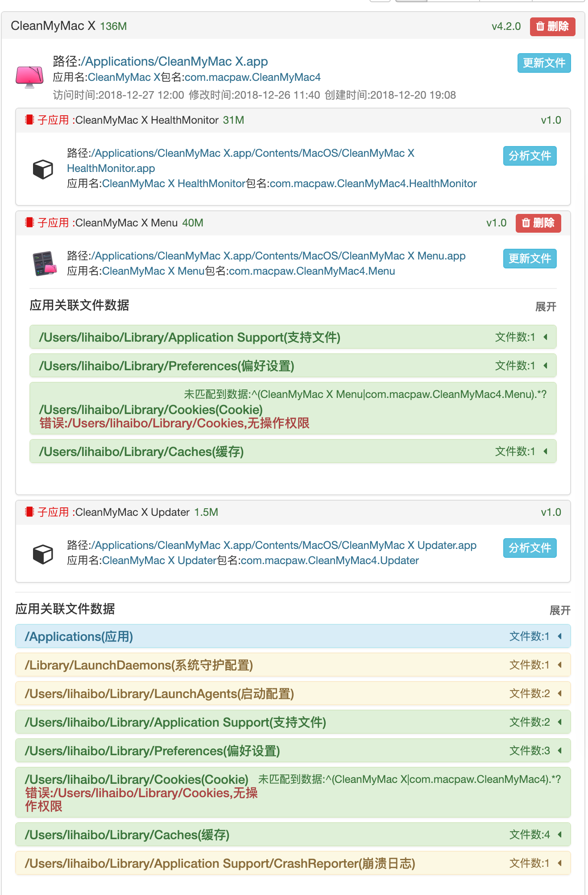
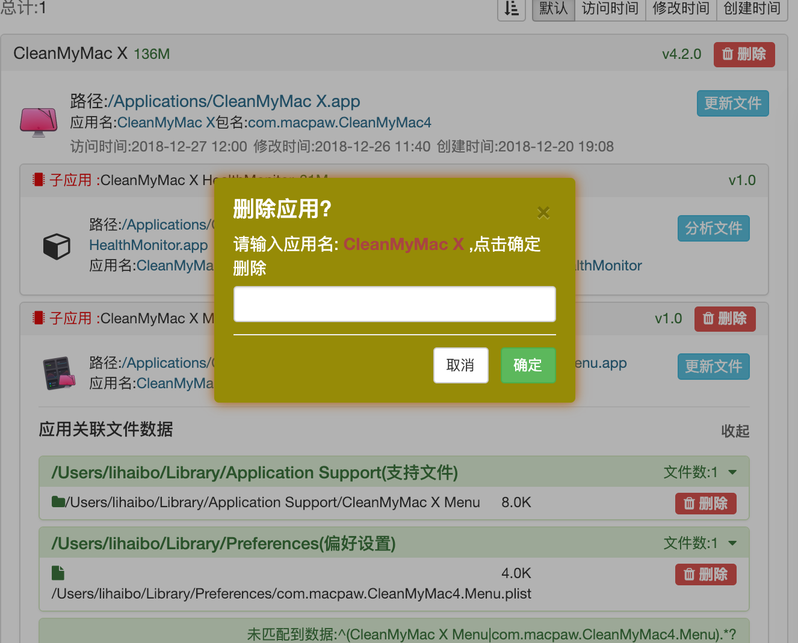

# MacClear

#### 介绍
自我充电.学习 Vue 等,就做了这个小工具.
帮助Mac 用户完全删除 App ,清理历史残留文件,
新功能需求/bug提交:
- 开源库:https://gitee.com/xeval/macclear 提交issues
- QQ:154624410
- 邮箱:lihaibo123as@163.com

#### 软件架构
检索指定目录 App,根据文件检索规则搜索关联文件,清理应用/子应用关联文件,队列操作提升检索性能.Vue 数据实时展示进度等.

#### 新版本预期
1. 检索规则配置模块,可自定义配置,提交云端存储,下载云端检索规则到本地提升检索精度.完美清理 app 残留文件
2. 全盘索引模块,检索历史残留文件
3. 日志模块,清理本地日志精简磁盘空间
4. 启用 Vue-router 模块,模块化开发,提升界面流程流畅度-待定可行性

#### 安装教程

1. 安装 nwjs 开发版,开发版,开发版 重要的事情说三遍
   1. 下载开发版 nwjs
   2. 配置别名: alias nw='/存放开发版目录/nwjs.app/Contents/MacOS/nwjs'
2. npm install

#### 使用说明

1. 运行调试:npm run start
2. 文件监听:npm run watch  or  gulp watch
3. 编译app:

#### 参与贡献

1. Fork 本仓库
2. 新建 Feat_xxx 分支
3. 提交代码
4. 新建 Pull Request

#### 流程界面

